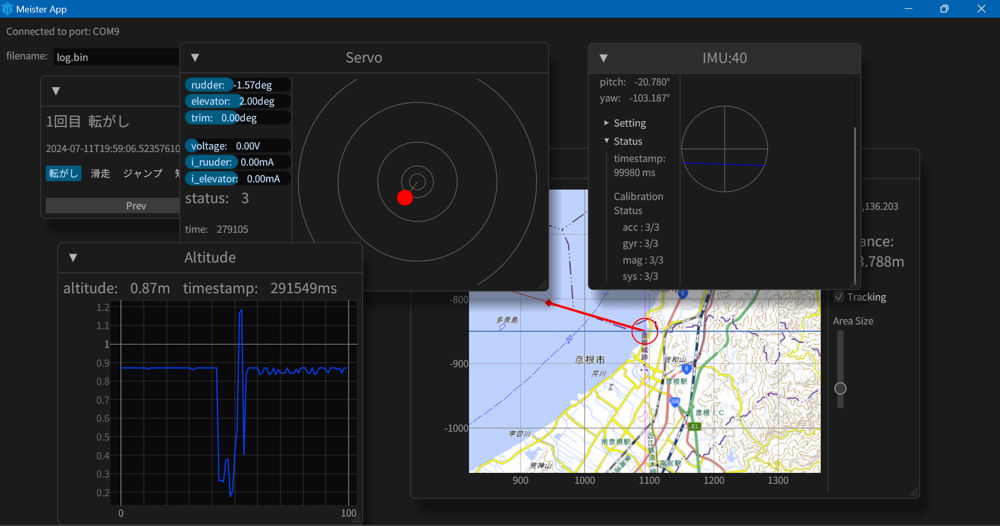

<div align="center">

# helium

A lightweight viewer for AIOLIA's avionics system.

</div>



## Installation

### From source

With Rust's package manager cargo, you can install

```sh
cargo install --git https://github.com/xsuz/helium.git --branch main
```

## Usage

```sh
helium
```